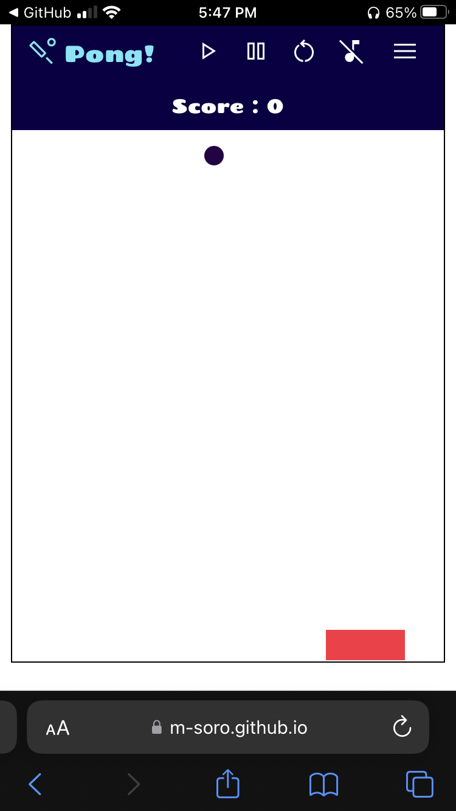
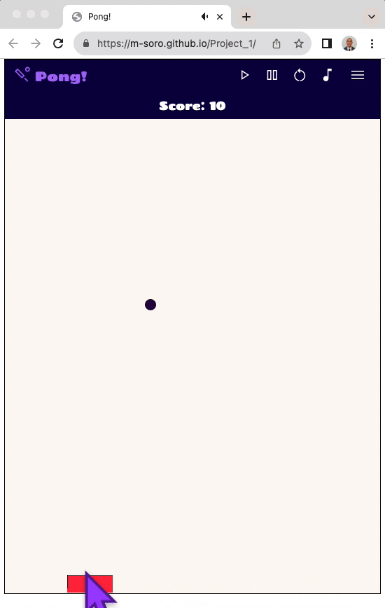

# Pong!

## **A super fun classic! This is Pong!**

## Play on 📱 mobile

## 

## Play on 💻 or desktop

## 

---

This is project one of three for my Software Enegineering course at PerScholas.

## Keyboard Controls:

- **Left Arrow Key** - move left
- **Right Arrow Key** - move right
- **Enter/Return Key** - start game
- **Spacebar** - pause game
- **r** - re-start game

## Alternatively, use your mouse to drag the paddle!

## About the Project

**Introduction**

I am so glad the way this project turned out. I had a lot of fun building it as well as playing it!
Take about design
the challenge
the UI experience

**Process**

**Preparation**

- Execution
- Revisions

Future Plans
Acknowledgement
