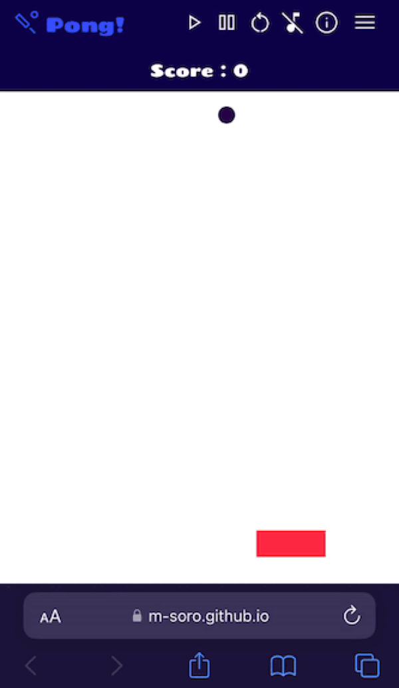

# Pong!

## **A classic fun!**

## Play on 📱

## Play on 💻

**Save or bookmark this link https://m-soro.github.io/Project_1/**

**or share with QR code**

This is my first project for the Software Enegineering course at PerScholas.

**Keyboard Controls:**

- **Left Arrow Key** - move left
- **Right Arrow Key** - move right
- **Enter/Return Key** - start game
- **Spacebar** - pause game
- **r** - re-start game

**Alternatively, use your mouse to drag the paddle.**

## About the Project

**Introduction**

I am so glad the way this app turned out. My goal is to create an interactive and engaging app.
I wanted a clean, minimalist look while offering functionalities that the user may expect.
It was a lot of fun building it, and playing with it.

## Process

**Planning**

This is my first collision based game. I started researching and looking at how other devs implemented a collision detection function. This took about a day.

**Execution**

I wanted to use object oriented principles, so I used classes for the ball and paddle. I then imported these two to the main script, and that's how far I got into it. I immediately found it difficult to conceptualize how all these pieces work together.

Now that the app is functioning, I could visualize a blueprint for how the object's methods and the app script's functions can work together.

**Challenges**

**Back End**

- The ball velocity and CSS position property are two different data types. I keep on forgetting that these are strings and that these needed to be converted to ints before processing them.
- What I could have done is define this properties as ints in the object's constructor class and then just concatenate the "px" after values have been processed and ready to be assigned to CSS. I didn't get to refactor this due to project deadline.
- There are many tutorials on how to write a collision detection function, what I found helpful is to break this function down so I could fully understand it. I found it difficult to comprehend a long conditional statement.
- I had a lot of confusion with the screen's X and Y coordinates.
- Confusion with the ball X and Y values to CSS properties. I spent a lot of time trying to debug something simple like this.

**Front End**

- I knew I wanted a clean, minimalist look but intuitive as well. At first I wanted show all the modes and features in the header thru icons but there is only limited space when viewed in small screen.
- This is where I created an inner menu drop down, now the problem is that playing area is getting smaller and smaller as I am adding another layer on top of the screen.
- I fixed this by inverting the color of the ball and toggling between showing and hiding the inner menu. Now the app has a header and the ball bounces in full screen.
- The mode selection options are all related so its only one function. The sounds and background are separate. At first I was hardcoding a function that closes the inner menu when other options are clicked but it would for some and will not for others.
- The solution was to create a separate function that will just close the inner menu regardless of what is clicked.

**Design and Flourishes**

- To keep the clean and minimal look:
- I opted for only one font type and solid colors for header and background color choices.
- The main title and motivating messages that flashes every 20 points gradually changes hue.
- A happy chime plays every 100 points.
- Some icons mutate and changes color when clicked.
- After the game is over I used colors and icon mutation to guide the user what should they do next.

**Known Issues**

- The ball sometimes "runs" in the paddle.

**Future Plans**

- Re-write this using object oriented principles.
- Fix the ball "running" issue.
- Improve the collision detection function. A more advance approach is alter the velocity of the ball depending on where it hit the paddle.
- If time permits, I may update the UI to be seasonal, i.e. halloween theme, holiday etc.

**Acknowledgement**

- Youtube Tutorials
- LinkedIn Learning
- Sound effects and music from mixkit.co
- My app tester J.K.
- And the excellent instructors at PerScholas
